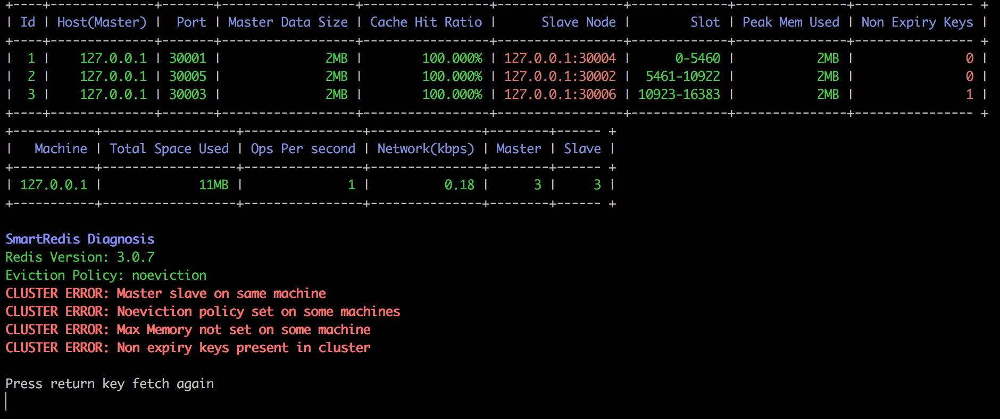

# Rediscluster Status



One of the functionality of SmartRedis is rediscluster analysis. SmartRedis displays the cluster health along with nodes and machine metrics. Apart from cluster metrics, smartredis clearly displays errors and warnings which can be used to check cluster health.

# Getting Started
```
wget https://github.com/akhilesh18992/smartRedis/raw/master/smartRedis_linux
chmod +x smartRedis_linux
```

## Prerequisites
redis-cli should be present.

https://redis.io/topics/quickstart


## Using binary
Use `./smartRedis_linux -h` to see all the options.
To resolve ip to hostname set resolveHostname to y, you would get a prompt to enter ssh username and password
```
./smartRedis_linux -action=status -redisHost=10.84.244.242 -redisPort=7000 -resolveHostname=n -repeatInterval=5
```


# Building binary from source

```
git clone https://github.com/akhilesh18992/smartRedis

GOOS=linux GOARCH=amd64 go build
```

